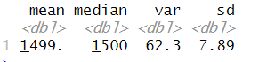
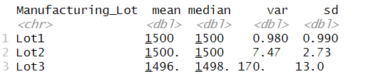

# Mod16_Challenge

## Linear Regression to Predict MPG

1. The intercept, vehicle length, and ground clearance show a non-random amount of variance to the mpg.  

2. The slopes for vehicle_length and ground_clearance are positive and above 6.267 and 3.546 respectively.  The slopes for the vehicle_weight (.0012) and spoiler_angle (.07) are close to zero.  The slope for AWD is -3.411 indicating a negative relationship and, although different from 0, was not significant. 

3. The R-square is above 0.7 which indicates that we have explained a significant amount of variance with our model.  However, since the intercept is significant, there is an indication that there are variables that are related to the mpg that we haven't accounted for.  In addition, there are three variables which we should consider removing and see if we can obtain a better fit since they are not significant and may be adding to the over-fitting of the model. 

## Summary Statistics on Suspension Coils

The design specification that the variance of the suspension coils must not exceed 100 pounds per square inch is met when looking at all the coils together in that the variance is 62.3.  However, when looking at individual lots, a problem with lot 3 becomes apparent in that the variance is 170 which is close to twice the limit.

## T-Tests on Suspension Coils

Lot1 and Lot2 fail to reject the null hypothesis. The mean for Lot1 is right at 1500 and the mean for Lot2 is 1500.2. However, for Lot3 we reject the null hypothesis in that the mean of 1496.14 is statistically different from the value of 1500.

[1] "Lot1"

   One Sample t-test

data:  lot$PSI
t = 0, df = 49, p-value = 1
alternative hypothesis: true mean is not equal to 1500
95 percent confidence interval:
 1499.719 1500.281
sample estimates:
mean of x 
     1500 

[1] "Lot2"

   One Sample t-test

data:  lot$PSI
t = 0.51745, df = 49, p-value = 0.6072
alternative hypothesis: true mean is not equal to 1500
95 percent confidence interval:
 1499.423 1500.977
sample estimates:
mean of x 
   1500.2 

[1] "Lot3"

   One Sample t-test

data:  lot$PSI
t = -2.0916, df = 49, p-value = 0.04168
alternative hypothesis: true mean is not equal to 1500
95 percent confidence interval:
 1492.431 1499.849
sample estimates:
mean of x 
  1496.14 

## Study Design: MechaCar vs Competition

MechaCar is the newest fuel-efficient compact model for the company.  It was designed in answer to the public’s call for reducing the use of fossil fuels.  Although the primary measure of interest is miles/gallon, a big driver in sales is acceleration.  Therefore, we will be comparing MechaCar against comparable competition cars on how many seconds it takes to reach 60 miles/hour from a standing start commonly referred to as 0-60.

Our null hypothesis is that MechaCar is equal to the population average for compact efficiency models.  The alternative hypothesis is that MechaCar has a smaller value, which translates into a quicker start.  

A sample of data would need to be collected from several (20 or more) different MechaCars.  The 0-60 scores for the competition can be extracted from various online publications that review fuel-efficient compact cars. These scores can be synthesized into a single comparison measure to be used in a one-sample t-test.

